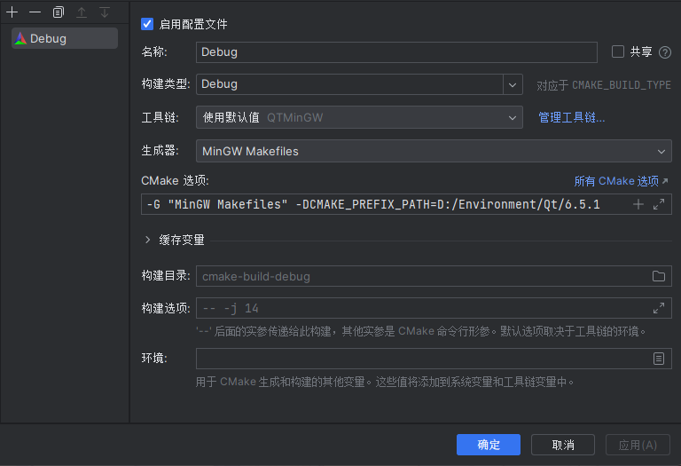
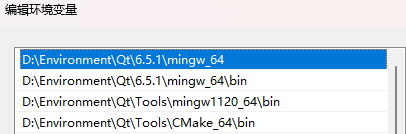

## c++笔记-->QT

全篇使用clion为主，qtcreator为辅来进行qml+qt6的开发

### 新建项目

在qtcreator新建普通的qtquick项目，然后打开在clion

转到clion"设置->构建执行部署->工具链"内，如下图配置一个新的配置。其中的cmake用qt自带的、clion自带的或自己下的都行，但工具集要选中qt的mingw


然后转到下方的cmake设置，使用工具链使用上面设置的



转到系统环境变量设置，添加以下四项，作为运行时使用（未添加会显示找不到qt组件的库文件）



在项目根目录下的CMakeLists.txt中添加这几项，如果已有相同的，则不需要添加

```makefile
set(CMAKE_CXX_STANDARD_REQUIRED ON)
set(CMAKE_CXX_STANDARD 23) #这个表示使用c++23语言标准，可自行更改
set(CMAKE_AUTOMOC ON)
set(CMAKE_AUTORCC ON)
set(CMAKE_AUTOUIC ON)
set(CMAKE_PREFIX_PATH "D:/Environment/Qt/6.5.1/mingw_64/lib/cmake") #这个请改为自己的相应路径，作用是让cmake找到qt所有组件的.cmake文件，它们一般在lib/cmake路径下

qt_standard_project_setup()
```

