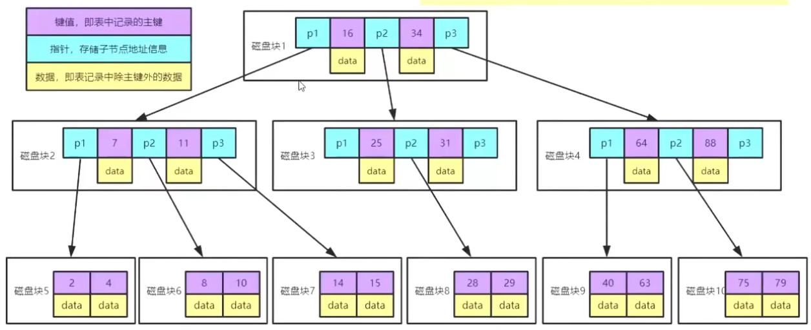
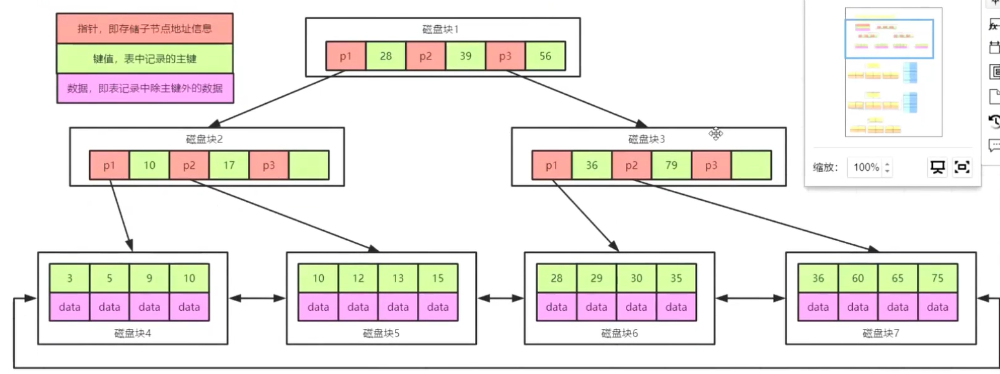

## linux运维笔记-->mysql优化

### 日志系统

在mysql中有几种日志。

- undolog

  回滚日志使用记录数据在变更前状态的方式来达到回滚的效果。它保证了原子性。属于innodb引擎。

- redolog

  预写日志，无需在真正在磁盘里面查找修改数据，而是用WAL的方式，先预写完成后修改。防止的是修改时出问题导致数据不一致。属于innodb引擎。

- binlog

  进行主从复制的日志，主服务器以此日志来同步从服务器。在主从结构时必须进行二阶段提交，即redolog和binlog都提交成功，否则都不修改以此保证主从服务器的一致性。

- relaylog

  中继日志。在进行主从复制的时候，随从服务器里先存储的日志文件。

- slowlog

  慢查询日志。记录超过指定时长的sql语句的日志。

- errorlog

  错误日志。记录执行错误。

### 高并发场景下的mysql

1. 并发读与读

   高并发时所有的访问用户都是读操作，此时不存在任何数据安全问题。

2. 并发读与写

   高并发时有部分用户在读有部分用户在写操作，此时存在数据安全问题，如脏读、幻读和不可重复读

3. 并发写与写

   高并发时所有的访问用户都是写操作，此时存在数据安全问题，如更新丢失。

#### 当前读与快照读

当前读指总是读新数据，快照读指读老数据。除了select以外，所有的操作都是当前读。

#### 数据安全问题

不可重复读：指在同一个事务中，对于同一组数据读取到的结果不一致。因为这个事务读到另一个事务修改后并提交的数据（update）导致。只能用锁行解决。

幻读：由于快照读和当前读差别的原因，select查询到和update等操作查询到的数据条数不一定，查询到的比更新的更多或更少就称为幻读。只能用锁表解决。如果都是操作都使用当前读就不会产生幻读。

脏读：数据还没提交就查询到这个数据，如果不提交这次查询到的就是错误数据。只能用序列化方法解决。

#### 隔离级别

在多数高并发场景下，并发读与写是最常见的。因此设置隔离级别来解决脏读幻读不可重复读问题。

1. 读未提交（ Read Uncommitted）：此级别下会产生不可重复读、幻读、脏读、丢失更新。
2. 读已提交（Read Committed）：此级别下会产生不可重复读、幻读、丢失更新，不会有脏读。一般此级别已经够用，效率高。
3. 可重复读（Repeatable Read）：此级别下会产生幻读、丢失更新，不会有不可重复读、脏读。强调数据安全时才会用此级别，mysql默认是这个。
4. 序列化（Serializable）：此级别下解决所有问题。以串行化加锁的方式解决，效率极其低下一般不会用。

#### MVCC（多版本并发控制）

它实现了不同的隔离级别，使用可见性算法，以不加锁的方式，解决并发“读写”冲突问题。它还在数据表定义时添加一些隐藏字段。

- DB_TRX_ID：最近修改事务的id
- DB_ROLL_PTR：回滚指针，指向上一个版本
- DB_ROW_ID：隐藏主键，当表没有主键的时候才会生成6个字节的行id

### 存储引擎

存储引擎是不同数据文件在磁盘中的不同组织方式。mysql有多种存储引擎，InnoDB引擎查询于磁盘中、MySAM引擎查询磁盘中、memory引擎查询于内存中、CSV和PERFORMANCE_SCHEMA等，常用的是前两个。可以用show engines查看。

在InnoDB存储引擎下的数据组织结构方式为frm加ibd。两个文件都存储在磁盘中，由frm文件来存储文件结构，ibd文件来存储索引和数据。

在MySAM存储引擎下的数据组织结构方式为frm加MYD加MYI。两个文件都存储在磁盘中，由frm文件来存储文件结构，MYD文件来存储数据，MYI文件来存储索引。

### mysql语句执行流程

- 第一层：客户端发送请求（字符串)
- 第二层：连接器控制用户连接
- 第三层：分析器分析传入的字符串的词法和语法
- 第四层：优化器对分析正确的sql语句进行优化，规定执行流程。
- 第五层：执行器执行优化好的sql语句
- 第六层：查询三种存储引擎中存放在不同位置不同文件格式的数据

### 优化器

mysql有两种默认的语句优化器，一种是基于成本的CBO、一种是基于规则的RBO。一般选择优先效率的CBO。

### 检查延时点

#### show profiles

在mysql8.0之前可以紧接着查询语句后使用show profiles指令来查看语句总运行时间，使用show profile来查看执行语句每一个流程的时间。以此进行判断来检查延时的点以便优化。

具体在官网的这里可以查看用法（https://dev.mysql.com/doc/refman/8.0/en/show.html），可以加参数cpu、block io、IPC等查看详细的性能使用信息。

| 状态                 | 详细              |
| -------------------- | ----------------- |
| starting             | 准备mysql服务时间 |
| checking permissions | 检查权限时间      |
| opening tables       | 打开表格时间      |
| init                 | 初始化时间        |
| system lock          | 系统锁时间        |
| optimizing           | 优化时间          |
| statistics           | ？                |
| preparing            | 准备时间          |
| executing            | 执行时间          |
| sending data         | 发送数据时间      |
| end                  | 结束时间          |
| query end            | 队列结束时间      |
| closing table        | 关闭表格时间      |
| freeing items        | 清理项目时间      |
| cleaning up          | 清理时间          |


#### performance schema

在mysql8.0之后专门在数据库内生成performance schema表格用于记录各项性能耗费。此表格只在内存中存储，不进行持久化。

它默认是开启的状态，只能在my.cnf（linux一般在/etc下）配置文件中修改。

```ini
[mysqld]
performance_schema=ON
```

### 连接池监控

#### druid

它是jdbc的一个组件，作为数据库连接池的同时还有监控的功能。

### 数据类型优化

- 在数据可接受范围内，数据类型越小越好。
- 简单数据类型更好，整型比字符操作代价低。
- 用mysql日期类型来存储时间而不是字符串来存储。
- 用整型来存储ip地址
- 避免使用null，可以用空字符串（""）

### 高性能索引

mysql的InnoDB和MySAM存储引擎的索引系统默认使用B+树（MEMORY用的是hash）。索引和数据放在一起是InnoDB，不在一起是MySAM。

#### 存储结构

##### 磁盘预读取

程序和数据最近访问都有聚集成群的倾向，在一个时间段内仅适用一小部分成为空间局部性，最近访问过的代码很快又被再访问称为时间局部性。

磁盘预读取就是用了这个原理，往往都是磁盘读取到内存都是读磁盘的一块空间称为页。在许多操作系统中一般磁盘页大小为4k，内存和磁盘以页为单位交换数据。

##### 选择B+树的理由

- hash（实现为数组加红黑树或数组加链表）的方式，即使在有扰动函数（将高位右移16位的算法，为让数据散列得更均匀）的情况下，最完美的算法也不可避免的冲突。并且hash耗费内存空间。大多数情况下都是范围查询而不是等值查询（hash在等值查询下非常快）。
- 红黑树、二叉树、BST树、AVL树的方式（这些树都是将值存储在节点内，仅有一个值），由于磁盘预读取是读取块的，必定会有些无用的数据。这些无用数据会造成节点增多导致树的深度增加，从而导致io次数变多影响数据读取效率。
- B树、B+树（这些树都是将值的集合存储在节点内，集合中有多少个值决定于maxdegree最大度）它极大减少树的深度。

##### InnoDB在硬盘内存储结构

整体为B树，里面的值的组成为主键、指针（指向下一个节点）和数据。树的每一个节点都有不多于最大度（maxdegree）的值的数量，且节点实际大小为16k（4个磁盘页）。因为节点内同时存有数据的原因，数据会占用上层节点很大一部分空间导致最大度缩小，因此有了B+树。



在mysql内实际实现为B+树，它将上层节点的数据去掉，让最大度增加，也留出更大的空间给主键和指针。在叶子节点重复储存已经命中的主键和数据。



#### 回表

在用二阶索引（两层索引、辅助索引）时会触发回表，即用索引找索引再找数据。在表中数据量少的时候效果不佳，因为io耗费高不如直接索引，只有数据量够大触发回表才会快。

#### 最左匹配

优先匹配是索引的字段，后匹配不是索引的字段。如果语句中同时有索引的字段和不是索引的字段，优化器会调换语句让有索引的字段优先。

#### 索引覆盖

一次索引就能查询到结果的情况叫索引覆盖。

#### 索引下推

原本在内存中筛选的数据下推到磁盘中，整体的io量减少提升了性能
